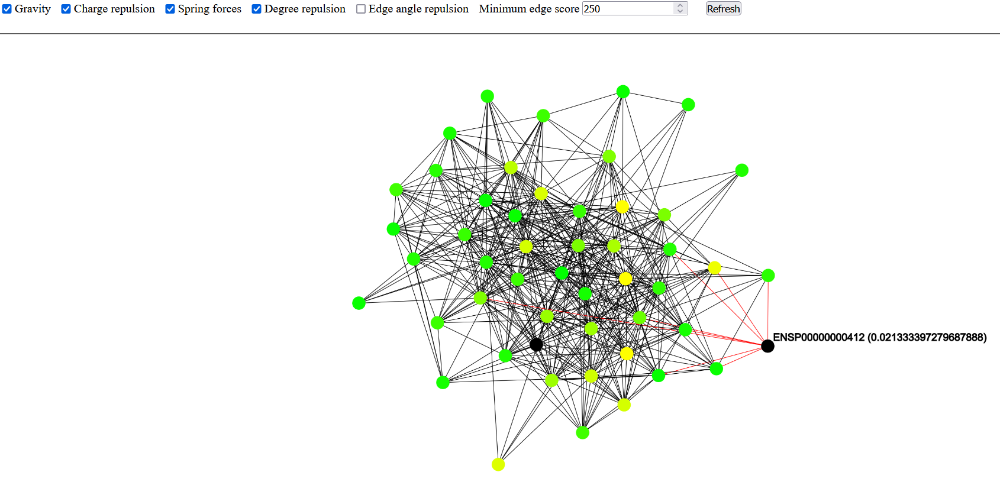

# ppigepred

Ppigepred (Protein-Protein Interaction GEne PREDiction) is a *very* simple software that takes a protein-pretein interaction network and a list of genes related to a phenotype of interest and predicts a list of other candidate genes that are potentially related to the phenotype.

Prediction is done using a basic random walk with restart approach.

## Supported features

- Interactive graph visalization
- Export graph to graphviz dot
- Parallelism
- Supports both protein and gene ids for input/output.

# Installation

```bash
$ git clone https://github.com/mzdravkov/ppigepred
$ cd ppigepred

$ python3 -m venv env
$ source env/bin/activate

$ pip install -r requirements.txt
```

# Usage

Simulate 1000 random walks with a return probability of 5% and extract the top 100 proteins that have score of at least 0.0005. Results will be printed as a CSV to stdout.
```bash
$ python main.py --db ~/protein_links.csv
                 -r ENSP00000000412,ENSP00000485663
                 -w 1000
                 -rp 0.05
                 -m 0.0005
                 --top 100
```

Simulate 10000 random walks in parallel (4 cores) with a return probability of 1% and extract the top 100 proteins, writing the results to a file.
```bash
$ python main.py --db ~/protein_links.csv
                 -r ENSP00000000412,ENSP00000485663
                 -w 10000
                 -rp 0.01
                 --top 100
                 -p 4
                 -o top_100.csv
```

Filter protein interaction network to include only interactions with score > 500, simulate 1000 random walks with a return probability of 5% and extract the top 50 genes. Note that we're passing Ensemble gene ids and the program would also output gene ids instead of protein ids.
```bash
$ python main.py --db ~/protein_links.csv
                 -r ENSG00000000003,ENSG00000000005,ENSG00000000419
                 -w 1000
                 -rp 0.05
                 --top 50
                 --min-interaction-score 500
                 --gene_ids
```

Simulate 1000 random walks with a return probability of 5%, extract the top 100 proteins, and run a web server with an interactive visualization of the resulting graph.
```bash
$ python main.py --db ~/protein_links.csv
                 -r ENSP00000000412,ENSP00000485663
                 -w 1000
                 -rp 0.05
                 --top 50
                 -i
```
Interactive visualization of the protein interaction graph induced by the 50 proteins with highest score:


